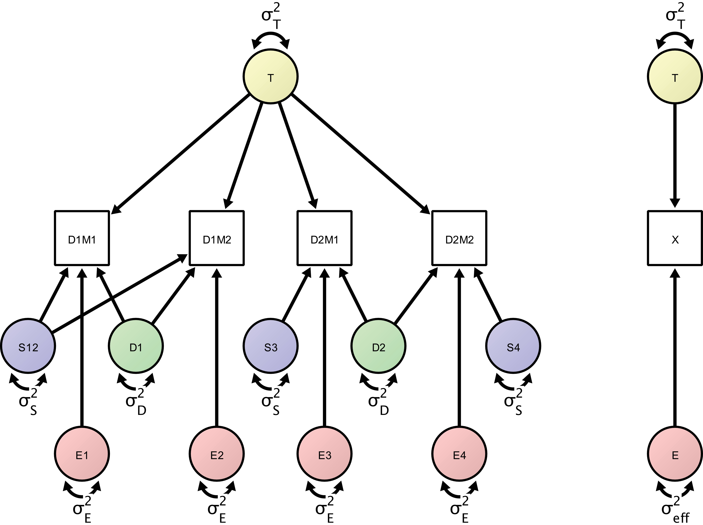

```{r setup, include=FALSE}
knitr::opts_chunk$set(echo = TRUE)
```

```{r}
library("lavaan")

source("ICED_syntax.R")
source("ICED_run.R")
source("ICED_boot.R")
source("str2cov.R")
source("sim_ICED.R")

```


## ICED: IntraClass Effect Decomposition


This script is intended to highlight progress and functionality with the ICED package

## generate syntax

The `ICED_syntax()` function takes a dataframe and generates the lavaan syntax to run the model (the first variable must be time). Here we save it to the `syn` object. The model will also be printed to the console. We are aiming to recreate the model from Brandmaier et al. (2018), Figure 4

{width=50%}


```{r}
struc <- data.frame(time = c("T1", "T2", "T3", "T4"),
                    day = c("day1","day1","day2","day2"),
                    session = c("ses1", "ses1","ses2", "ses3"))

syn <- iced_syntax(struc)

```

## simulate data

We'll simulate data to run the ICED model on. The `sim_ICED` function takes the model structure dataframe we used earlier and a list of variances for each latent variable. The function returns several outputs, including the simulated data. 

```{r}
sim1 <- sim_ICED(struc,
                 variances = list(time = 10,
                                  day = 2,
                                  session = 1,
                                  error = 3),
                 n = 2000)

head(sim1$data)

```

we can also examine how well `sim_ICED` has recovered our variance parameters by setting `check_recovery = TRUE`. lets simulate two datasets, one large and another small. 

```{r}
sim2 <- sim_ICED(struc,
                 variances = list(time = 10,
                                  day = 2,
                                  session = 1,
                                  error = 3),
                 n = 2000,
                 check_recovery = TRUE)


sim3 <- sim_ICED(struc,
                 variances = list(time = 10,
                                  day = 2,
                                  session = 1,
                                  error = 3),
                 n = 20,
                 check_recovery = TRUE)

```

### str2cov

The `sim_ICED` function uses a helper function `str2cov`, which takes the same structure data.frame and the list of variances we specified earlier  to generate the expected covariance of the model. This is then passed to `mvrnorm` to generate the data. e.g.

```{r}
str2cov(struc,
        list(time = 10,
             day = 2,
             session = 1,
             error = 3))

```


## run_ICED

we can now run our model. The `run_ICED` function will print a bunch of relevant outputs. Note that the `sim_ICED` function returns a list of objects, so we need to specify the data part

```{r}
res1 <- run_ICED(model = syn,
                 data = sim1$data)

```

we can also bootstrap our estimates. The output now includes 95% CIs on the ICC and ICC2. Best to use more than 10 boots, but set to 10 for speed here

```{r}
run_ICED(model = syn,
         data = sim1$data,
         boot = 10)

```

## model comparison

we can compare alternative models, for example constraining the variance of one component to zero

```{r}
syntax2 <- iced_syntax(struc,
                       set_variances = c(res1$timeest, 
                                         res1$dayest, 
                                         0,
                                         res1$eest))

res2 <- run_ICED(syntax2,
                 sim1$data)

anova(res1$lavaan,
      res2$lavaan)

```


# group comparisons

we can use `iced_syntax` to generate the syntax for multiple groups. The user can specify a number of groups or a vector of strings. Here we'll also highlight that we can set the variances to be greater than zero also.

```{r}
group_syntax <- iced_syntax(struc,
                            groups = 2,
                            fix_lower_bounds = TRUE)

group_syntax <- iced_syntax(struc,
                            groups = c("group1", "group2"),
                            fix_lower_bounds = TRUE)

```

generating multiple group data takes a few more lines of code currently - but I plan to adapt this to take vectors within the lists. 

```{r}
variances_hi <- list(time = 8,
                  day = .25,
                  session = .2,
                  error = .25)

variances_lo <- list(time = 2,
                     day = .25,
                     session = .2,
                     error = .25)

sim_hi <- sim_ICED(structure = struc,
                 variances = variances_hi,
                 n = 100)$data

sim_lo <- sim_ICED(structure = struc,
                 variances = variances_lo,
                 n = 100)$data

sim_hi$group <- "high"
sim_lo$group <- "low"

sim_all <- rbind(sim_hi, sim_lo)

```

we can check the ICC reliability we have specified fairly easily, e.g. for the high group `variances_hi$time / (sum(unlist(variances_hi)))`. For the high group ICC = `r variances_hi$time / (sum(unlist(variances_hi)))`, and the low group ICC = `r variances_lo$time / (sum(unlist(variances_lo)))`.

Then we can compare the groups (not currenly within run_ICED). Here, m0 is our base model constraining variances across groups, and m1 using the model we just generated to allow them to vary across groups.

```{r}
m1 <- lavaan::lavaan(model = group_syntax,
               data = sim_all,
               group = "group")

m0 <- lavaan::lavaan(model = syn,
                     data = sim_all,
                     group = "group")

summary(m1)
summary(m0)

anova(m1, m0)

```