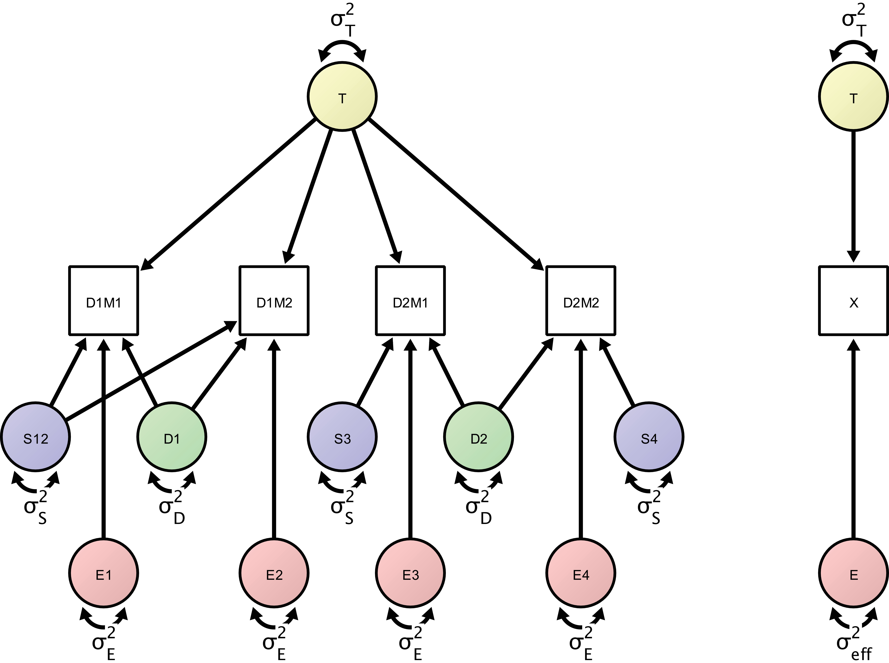

ICED
================

``` r
library("lavaan")
```

    ## This is lavaan 0.6-8
    ## lavaan is FREE software! Please report any bugs.

``` r
source("R/ICED_syntax.R")
source("R/ICED_run.R")
source("R/ICED_boot.R")
source("R/str2cov.R")
source("R/sim_ICED.R")
```


## ICED: IntraClass Effect Decomposition

This script is intended to highlight progress and functionality with the
ICED package

## generate syntax

The `ICED_syntax()` function takes a dataframe and generates the lavaan
syntax to run the model (the first variable must be time). Here we save
it to the `syn` object. The model will also be printed to the console.
We are aiming to recreate the model from Brandmaier et al. (2018),
Figure 4

<figure>

<figcaption aria-hidden="true">Brandmaier et al. (2018) Figure
4</figcaption>
</figure>

``` r
struc <- data.frame(time = c("T1", "T2", "T3", "T4"),
                    day = c("day1","day1","day2","day2"),
                    session = c("ses1", "ses1","ses2", "ses3"))

syn <- iced_syntax(struc)
```

    ## ! regressions
    ## T =~ 1*T1
    ## T =~ 1*T2
    ## T =~ 1*T3
    ## T =~ 1*T4
    ## day1 =~ 1*T1
    ## day1 =~ 1*T2
    ## day2 =~ 1*T3
    ## day2 =~ 1*T4
    ## ses1 =~ 1*T1
    ## ses1 =~ 1*T2
    ## ses2 =~ 1*T3
    ## ses3 =~ 1*T4
    ## E1 =~ 1*T1
    ## E2 =~ 1*T2
    ## E3 =~ 1*T3
    ## E4 =~ 1*T4
    ## ! residuals, variances and covariances
    ## T ~~ time*T
    ## day1 ~~ day*day1
    ## day2 ~~ day*day2
    ## ses1 ~~ session*ses1
    ## ses2 ~~ session*ses2
    ## ses3 ~~ session*ses3
    ## E1 ~~ e*E1
    ## E2 ~~ e*E2
    ## E3 ~~ e*E3
    ## E4 ~~ e*E4
    ## T ~~ 0*day1
    ## T ~~ 0*day2
    ## T ~~ 0*ses1
    ## T ~~ 0*ses2
    ## T ~~ 0*ses3
    ## T ~~ 0*E1
    ## T ~~ 0*E2
    ## T ~~ 0*E3
    ## T ~~ 0*E4
    ## day1 ~~ 0*day2
    ## day1 ~~ 0*ses1
    ## day1 ~~ 0*ses2
    ## day1 ~~ 0*ses3
    ## day1 ~~ 0*E1
    ## day1 ~~ 0*E2
    ## day1 ~~ 0*E3
    ## day1 ~~ 0*E4
    ## day2 ~~ 0*ses1
    ## day2 ~~ 0*ses2
    ## day2 ~~ 0*ses3
    ## day2 ~~ 0*E1
    ## day2 ~~ 0*E2
    ## day2 ~~ 0*E3
    ## day2 ~~ 0*E4
    ## ses1 ~~ 0*ses2
    ## ses1 ~~ 0*ses3
    ## ses1 ~~ 0*E1
    ## ses1 ~~ 0*E2
    ## ses1 ~~ 0*E3
    ## ses1 ~~ 0*E4
    ## ses2 ~~ 0*ses3
    ## ses2 ~~ 0*E1
    ## ses2 ~~ 0*E2
    ## ses2 ~~ 0*E3
    ## ses2 ~~ 0*E4
    ## ses3 ~~ 0*E1
    ## ses3 ~~ 0*E2
    ## ses3 ~~ 0*E3
    ## ses3 ~~ 0*E4
    ## E1 ~~ 0*E2
    ## E1 ~~ 0*E3
    ## E1 ~~ 0*E4
    ## E2 ~~ 0*E3
    ## E2 ~~ 0*E4
    ## E3 ~~ 0*E4
    ## ! observed means
    ## T1~1
    ## T2~1
    ## T3~1
    ## T4~1
    ## !set lower bounds of variances
    ## time > 0.0001 
    ## day > 0.0001 
    ## session > 0.0001 
    ## e > 0.0001

## simulate data

We’ll simulate data to run the ICED model on. The `sim_ICED` function
takes the model structure dataframe we used earlier and a list of
variances for each latent variable. The function returns several
outputs, including the simulated data.

``` r
sim1 <- sim_ICED(struc,
                 variances = list(time = 10,
                                  day = 2,
                                  session = 1,
                                  error = 3),
                 n = 2000)

head(sim1$data)
```

    ##             T1         T2        T3         T4
    ## 1 -6.892969387 -6.5932264 -8.723213 -7.6298887
    ## 2  2.563843435  6.7974728  1.521446  3.0070102
    ## 3  3.750682653  2.0135844  1.898953  3.3198217
    ## 4 -0.008140112  0.8534418 -2.378560 -0.9479120
    ## 5 -2.319533037 -2.1481638 -3.104065 -0.6225882
    ## 6  3.568513686  0.6051093  1.038575 -3.9176493

we can also examine how well `sim_ICED` has recovered our variance
parameters by setting `check_recovery = TRUE`. lets simulate two
datasets, one large and another small.

``` r
sim2 <- sim_ICED(struc,
                 variances = list(time = 10,
                                  day = 2,
                                  session = 1,
                                  error = 3),
                 n = 2000,
                 check_recovery = TRUE)
```

    ## [1] "n =  2000 data simulated"
    ## [1] "data simulated based on ICC1 =  0.625"
    ##    time     day session   error 
    ##      10       2       1       3 
    ## [1] "model parameters recovered:"
    ## [1] "ICC1 = 0.644583202724004"
    ##    timeest     dayest sessionest       eest 
    ## 10.5419826  1.9993960  0.8164775  2.9968714

``` r
sim3 <- sim_ICED(struc,
                 variances = list(time = 10,
                                  day = 2,
                                  session = 1,
                                  error = 3),
                 n = 20,
                 check_recovery = TRUE)
```

    ## [1] "n =  20 data simulated"
    ## [1] "data simulated based on ICC1 =  0.625"
    ##    time     day session   error 
    ##      10       2       1       3 
    ## [1] "model parameters recovered:"
    ## [1] "ICC1 = 0.540163701082888"
    ##    timeest     dayest sessionest       eest 
    ##  6.4965675  0.5116045  2.2645328  2.7543297

### str2cov

The `sim_ICED` function uses a helper function `str2cov`, which takes
the same structure data.frame and the list of variances we specified
earlier to generate the expected covariance of the model. This is then
passed to `mvrnorm` to generate the data. e.g.

``` r
str2cov(struc,
        list(time = 10,
             day = 2,
             session = 1,
             error = 3),
        e_label = "error")
```

    ##    T1 T2 T3 T4
    ## T1 16 13 10 10
    ## T2 13 16 10 10
    ## T3 10 10 16 12
    ## T4 10 10 12 16

## run_ICED

we can now run our model. The `run_ICED` function will print a bunch of
relevant outputs. Note that the `sim_ICED` function returns a list of
objects, so we need to specify the data part

``` r
res1 <- run_ICED(model = syn,
                 data = sim1$data)
```

    ## $ICC
    ## [1] 0.6315415
    ## 
    ## $ICC2
    ## [1] 0.828968
    ## 
    ## $timeest
    ## [1] 10.12744
    ## 
    ## $dayest
    ## [1] 2.023995
    ## 
    ## $sessionest
    ## [1] 0.8988333
    ## 
    ## $eest
    ## [1] 2.985794
    ## 
    ## $EffectiveError
    ## [1] 2.089485
    ## 
    ## $AbsoluteError
    ## [1] 2.058057
    ## 
    ## $phi_dependability
    ## [1] 0.831106
    ## 
    ## $lavaan
    ## lavaan 0.6-8 ended normally after 209 iterations
    ## 
    ##   Estimator                                         ML
    ##   Optimization method                           NLMINB
    ##   Number of model parameters                        14
    ##   Number of inequality constraints                   4
    ##                                                       
    ##   Number of observations                          2000
    ##   Number of missing patterns                         1
    ##                                                       
    ## Model Test User Model:
    ##                                                       
    ##   Test statistic                                 3.685
    ##   Degrees of freedom                                 6
    ##   P-value (Chi-square)                           0.719
    ## 
    ## $est_cov
    ##    T1     T2     T3     T4    
    ## T1 16.036                     
    ## T2 13.050 16.036              
    ## T3 10.127 10.127 16.036       
    ## T4 10.127 10.127 12.151 16.036

we can also bootstrap our estimates. The output now includes 95% CIs on
the ICC and ICC2. Best to use more than 10 boots, but set to 10 for
speed here

``` r
run_ICED(model = syn,
         data = sim1$data,
         boot = 10)
```

    ## Warning in norm.inter(t, alpha): extreme order statistics used as endpoints

    ## Warning in norm.inter(t, alpha): extreme order statistics used as endpoints

    ## $ICC
    ## [1] 0.6315415
    ## 
    ## $ICC_CIs
    ## [1] 0.6190221 0.6469655
    ## 
    ## $ICC2
    ## [1] 0.828968
    ## 
    ## $ICC2_CIs
    ## [1] 0.8237431 0.8462589
    ## 
    ## $timeest
    ## [1] 10.12744
    ## 
    ## $dayest
    ## [1] 2.023995
    ## 
    ## $sessionest
    ## [1] 0.8988333
    ## 
    ## $eest
    ## [1] 2.985794
    ## 
    ## $EffectiveError
    ## [1] 2.089485
    ## 
    ## $AbsoluteError
    ## [1] 2.058057
    ## 
    ## $phi_dependability
    ## [1] 0.831106
    ## 
    ## $lavaan
    ## lavaan 0.6-8 ended normally after 209 iterations
    ## 
    ##   Estimator                                         ML
    ##   Optimization method                           NLMINB
    ##   Number of model parameters                        14
    ##   Number of inequality constraints                   4
    ##                                                       
    ##   Number of observations                          2000
    ##   Number of missing patterns                         1
    ##                                                       
    ## Model Test User Model:
    ##                                                       
    ##   Test statistic                                 3.685
    ##   Degrees of freedom                                 6
    ##   P-value (Chi-square)                           0.719
    ## 
    ## $est_cov
    ##    T1     T2     T3     T4    
    ## T1 16.036                     
    ## T2 13.050 16.036              
    ## T3 10.127 10.127 16.036       
    ## T4 10.127 10.127 12.151 16.036

## model comparison

we can compare alternative models, for example constraining the variance
of one component to zero

``` r
syntax2 <- iced_syntax(struc,
                       set_variances = c(res1$timeest, 
                                         res1$dayest, 
                                         0,
                                         res1$eest))
```

    ## Warning in iced_syntax(struc, set_variances = c(res1$timeest, res1$dayest, :
    ## set_variances must be list

    ## ! regressions
    ## T =~ 1*T1
    ## T =~ 1*T2
    ## T =~ 1*T3
    ## T =~ 1*T4
    ## day1 =~ 1*T1
    ## day1 =~ 1*T2
    ## day2 =~ 1*T3
    ## day2 =~ 1*T4
    ## ses1 =~ 1*T1
    ## ses1 =~ 1*T2
    ## ses2 =~ 1*T3
    ## ses3 =~ 1*T4
    ## E1 =~ 1*T1
    ## E2 =~ 1*T2
    ## E3 =~ 1*T3
    ## E4 =~ 1*T4
    ## ! residuals, variances and covariances
    ## T ~~ time*T
    ## day1 ~~ day*day1
    ## day2 ~~ day*day2
    ## ses1 ~~ session*ses1
    ## ses2 ~~ session*ses2
    ## ses3 ~~ session*ses3
    ## E1 ~~ e*E1
    ## E2 ~~ e*E2
    ## E3 ~~ e*E3
    ## E4 ~~ e*E4
    ## T ~~ 0*day1
    ## T ~~ 0*day2
    ## T ~~ 0*ses1
    ## T ~~ 0*ses2
    ## T ~~ 0*ses3
    ## T ~~ 0*E1
    ## T ~~ 0*E2
    ## T ~~ 0*E3
    ## T ~~ 0*E4
    ## day1 ~~ 0*day2
    ## day1 ~~ 0*ses1
    ## day1 ~~ 0*ses2
    ## day1 ~~ 0*ses3
    ## day1 ~~ 0*E1
    ## day1 ~~ 0*E2
    ## day1 ~~ 0*E3
    ## day1 ~~ 0*E4
    ## day2 ~~ 0*ses1
    ## day2 ~~ 0*ses2
    ## day2 ~~ 0*ses3
    ## day2 ~~ 0*E1
    ## day2 ~~ 0*E2
    ## day2 ~~ 0*E3
    ## day2 ~~ 0*E4
    ## ses1 ~~ 0*ses2
    ## ses1 ~~ 0*ses3
    ## ses1 ~~ 0*E1
    ## ses1 ~~ 0*E2
    ## ses1 ~~ 0*E3
    ## ses1 ~~ 0*E4
    ## ses2 ~~ 0*ses3
    ## ses2 ~~ 0*E1
    ## ses2 ~~ 0*E2
    ## ses2 ~~ 0*E3
    ## ses2 ~~ 0*E4
    ## ses3 ~~ 0*E1
    ## ses3 ~~ 0*E2
    ## ses3 ~~ 0*E3
    ## ses3 ~~ 0*E4
    ## E1 ~~ 0*E2
    ## E1 ~~ 0*E3
    ## E1 ~~ 0*E4
    ## E2 ~~ 0*E3
    ## E2 ~~ 0*E4
    ## E3 ~~ 0*E4
    ## ! observed means
    ## T1~1
    ## T2~1
    ## T3~1
    ## T4~1
    ## !set variances
    ##  
    ##  time == 10.1274398251025
    ##  day == 2.02399517103763
    ##  session == 0
    ##  e == 2.98579433458071

``` r
res2 <- run_ICED(syntax2,
                 sim1$data)
```

    ## $ICC
    ## [1] 0.6690418
    ## 
    ## $ICC2
    ## [1] 0.8520559
    ## 
    ## $timeest
    ## [1] 10.12744
    ## 
    ## $dayest
    ## [1] 2.023995
    ## 
    ## $sessionest
    ## [1] 0
    ## 
    ## $eest
    ## [1] 2.985794
    ## 
    ## $EffectiveError
    ## [1] 1.758446
    ## 
    ## $AbsoluteError
    ## [1] 1.758446
    ## 
    ## $phi_dependability
    ## [1] 0.8520559
    ## 
    ## $lavaan
    ## lavaan 0.6-8 ended normally after 1 iterations
    ## 
    ##   Estimator                                         ML
    ##   Optimization method                           NLMINB
    ##   Number of model parameters                        14
    ##   Number of equality constraints                    10
    ##                                                       
    ##   Number of observations                          2000
    ##   Number of missing patterns                         1
    ##                                                       
    ## Model Test User Model:
    ##                                                       
    ##   Test statistic                               113.780
    ##   Degrees of freedom                                10
    ##   P-value (Chi-square)                           0.000
    ## 
    ## $est_cov
    ##    T1     T2     T3     T4    
    ## T1 15.137                     
    ## T2 12.151 15.137              
    ## T3 10.127 10.127 15.137       
    ## T4 10.127 10.127 12.151 15.137

``` r
anova(res1$lavaan,
      res2$lavaan)
```

    ## Chi-Squared Difference Test
    ## 
    ##             Df   AIC   BIC    Chisq Chisq diff Df diff Pr(>Chisq)    
    ## res1$lavaan  6 39651 39696   3.6852                                  
    ## res2$lavaan 10 39753 39776 113.7797     110.09       4  < 2.2e-16 ***
    ## ---
    ## Signif. codes:  0 '***' 0.001 '**' 0.01 '*' 0.05 '.' 0.1 ' ' 1

# group comparisons

we can use `iced_syntax` to generate the syntax for multiple groups. The
user can specify a number of groups or a vector of strings. Here we’ll
also highlight that we can set the variances to be greater than zero
also.

``` r
group_syntax <- iced_syntax(struc,
                            groups = 2,
                            fix_lower_bounds = TRUE)
```

    ## ! regressions
    ## T =~ 1*T1
    ## T =~ 1*T2
    ## T =~ 1*T3
    ## T =~ 1*T4
    ## day1 =~ 1*T1
    ## day1 =~ 1*T2
    ## day2 =~ 1*T3
    ## day2 =~ 1*T4
    ## ses1 =~ 1*T1
    ## ses1 =~ 1*T2
    ## ses2 =~ 1*T3
    ## ses3 =~ 1*T4
    ## E1 =~ 1*T1
    ## E2 =~ 1*T2
    ## E3 =~ 1*T3
    ## E4 =~ 1*T4
    ## ! residuals, variances and covariances
    ## T ~~ c(lattime1,lattime2)*T
    ## day1 ~~ c(latday1,latday2)*day1
    ## day2 ~~ c(latday1,latday2)*day2
    ## ses1 ~~ c(latsession1,latsession2)*ses1
    ## ses2 ~~ c(latsession1,latsession2)*ses2
    ## ses3 ~~ c(latsession1,latsession2)*ses3
    ## E1 ~~ c(late1,late2)*E1
    ## E2 ~~ c(late1,late2)*E2
    ## E3 ~~ c(late1,late2)*E3
    ## E4 ~~ c(late1,late2)*E4
    ## T ~~ 0*day1
    ## T ~~ 0*day2
    ## T ~~ 0*ses1
    ## T ~~ 0*ses2
    ## T ~~ 0*ses3
    ## T ~~ 0*E1
    ## T ~~ 0*E2
    ## T ~~ 0*E3
    ## T ~~ 0*E4
    ## day1 ~~ 0*day2
    ## day1 ~~ 0*ses1
    ## day1 ~~ 0*ses2
    ## day1 ~~ 0*ses3
    ## day1 ~~ 0*E1
    ## day1 ~~ 0*E2
    ## day1 ~~ 0*E3
    ## day1 ~~ 0*E4
    ## day2 ~~ 0*ses1
    ## day2 ~~ 0*ses2
    ## day2 ~~ 0*ses3
    ## day2 ~~ 0*E1
    ## day2 ~~ 0*E2
    ## day2 ~~ 0*E3
    ## day2 ~~ 0*E4
    ## ses1 ~~ 0*ses2
    ## ses1 ~~ 0*ses3
    ## ses1 ~~ 0*E1
    ## ses1 ~~ 0*E2
    ## ses1 ~~ 0*E3
    ## ses1 ~~ 0*E4
    ## ses2 ~~ 0*ses3
    ## ses2 ~~ 0*E1
    ## ses2 ~~ 0*E2
    ## ses2 ~~ 0*E3
    ## ses2 ~~ 0*E4
    ## ses3 ~~ 0*E1
    ## ses3 ~~ 0*E2
    ## ses3 ~~ 0*E3
    ## ses3 ~~ 0*E4
    ## E1 ~~ 0*E2
    ## E1 ~~ 0*E3
    ## E1 ~~ 0*E4
    ## E2 ~~ 0*E3
    ## E2 ~~ 0*E4
    ## E3 ~~ 0*E4
    ## ! observed means
    ## T1~1
    ## T2~1
    ## T3~1
    ## T4~1
    ## !set lower bounds of variances
    ## lattime1 > 0.0001 
    ## lattime2 > 0.0001 
    ## latday1 > 0.0001 
    ## latday2 > 0.0001 
    ## latsession1 > 0.0001 
    ## latsession2 > 0.0001 
    ## late1 > 0.0001 
    ## late2 > 0.0001

``` r
group_syntax <- iced_syntax(struc,
                            groups = c("group1", "group2"),
                            fix_lower_bounds = TRUE)
```

    ## ! regressions
    ## T =~ 1*T1
    ## T =~ 1*T2
    ## T =~ 1*T3
    ## T =~ 1*T4
    ## day1 =~ 1*T1
    ## day1 =~ 1*T2
    ## day2 =~ 1*T3
    ## day2 =~ 1*T4
    ## ses1 =~ 1*T1
    ## ses1 =~ 1*T2
    ## ses2 =~ 1*T3
    ## ses3 =~ 1*T4
    ## E1 =~ 1*T1
    ## E2 =~ 1*T2
    ## E3 =~ 1*T3
    ## E4 =~ 1*T4
    ## ! residuals, variances and covariances
    ## T ~~ c(lattimegroup1,lattimegroup2)*T
    ## day1 ~~ c(latdaygroup1,latdaygroup2)*day1
    ## day2 ~~ c(latdaygroup1,latdaygroup2)*day2
    ## ses1 ~~ c(latsessiongroup1,latsessiongroup2)*ses1
    ## ses2 ~~ c(latsessiongroup1,latsessiongroup2)*ses2
    ## ses3 ~~ c(latsessiongroup1,latsessiongroup2)*ses3
    ## E1 ~~ c(lategroup1,lategroup2)*E1
    ## E2 ~~ c(lategroup1,lategroup2)*E2
    ## E3 ~~ c(lategroup1,lategroup2)*E3
    ## E4 ~~ c(lategroup1,lategroup2)*E4
    ## T ~~ 0*day1
    ## T ~~ 0*day2
    ## T ~~ 0*ses1
    ## T ~~ 0*ses2
    ## T ~~ 0*ses3
    ## T ~~ 0*E1
    ## T ~~ 0*E2
    ## T ~~ 0*E3
    ## T ~~ 0*E4
    ## day1 ~~ 0*day2
    ## day1 ~~ 0*ses1
    ## day1 ~~ 0*ses2
    ## day1 ~~ 0*ses3
    ## day1 ~~ 0*E1
    ## day1 ~~ 0*E2
    ## day1 ~~ 0*E3
    ## day1 ~~ 0*E4
    ## day2 ~~ 0*ses1
    ## day2 ~~ 0*ses2
    ## day2 ~~ 0*ses3
    ## day2 ~~ 0*E1
    ## day2 ~~ 0*E2
    ## day2 ~~ 0*E3
    ## day2 ~~ 0*E4
    ## ses1 ~~ 0*ses2
    ## ses1 ~~ 0*ses3
    ## ses1 ~~ 0*E1
    ## ses1 ~~ 0*E2
    ## ses1 ~~ 0*E3
    ## ses1 ~~ 0*E4
    ## ses2 ~~ 0*ses3
    ## ses2 ~~ 0*E1
    ## ses2 ~~ 0*E2
    ## ses2 ~~ 0*E3
    ## ses2 ~~ 0*E4
    ## ses3 ~~ 0*E1
    ## ses3 ~~ 0*E2
    ## ses3 ~~ 0*E3
    ## ses3 ~~ 0*E4
    ## E1 ~~ 0*E2
    ## E1 ~~ 0*E3
    ## E1 ~~ 0*E4
    ## E2 ~~ 0*E3
    ## E2 ~~ 0*E4
    ## E3 ~~ 0*E4
    ## ! observed means
    ## T1~1
    ## T2~1
    ## T3~1
    ## T4~1
    ## !set lower bounds of variances
    ## lattimegroup1 > 0.0001 
    ## lattimegroup2 > 0.0001 
    ## latdaygroup1 > 0.0001 
    ## latdaygroup2 > 0.0001 
    ## latsessiongroup1 > 0.0001 
    ## latsessiongroup2 > 0.0001 
    ## lategroup1 > 0.0001 
    ## lategroup2 > 0.0001

generating multiple group data takes a few more lines of code
currently - but I plan to adapt this to take vectors within the lists.

``` r
variances_hi <- list(time = 8,
                  day = .25,
                  session = .2,
                  error = .25)

variances_lo <- list(time = 2,
                     day = .25,
                     session = .2,
                     error = .25)

sim_hi <- sim_ICED(structure = struc,
                 variances = variances_hi,
                 n = 100)$data

sim_lo <- sim_ICED(structure = struc,
                 variances = variances_lo,
                 n = 100)$data

sim_hi$group <- "high"
sim_lo$group <- "low"

sim_all <- rbind(sim_hi, sim_lo)
```

we can check the ICC reliability we have specified fairly easily,
e.g. for the high group
`variances_hi$time / (sum(unlist(variances_hi)))`. For the high group
ICC = 0.9195402, and the low group ICC = 0.7407407.

Then we can compare the groups (not currenly within run_ICED). Here, m0
is our base model constraining variances across groups, and m1 using the
model we just generated to allow them to vary across groups.

``` r
m1 <- lavaan::lavaan(model = group_syntax,
               data = sim_all,
               group = "group")

m0 <- lavaan::lavaan(model = syn,
                     data = sim_all,
                     group = "group")
```

    ## Warning in lavaanify(model = FLAT, constraints = constraints, varTable = lavdata@ov, : lavaan WARNING: using a single label per parameter in a multiple group
    ##   setting implies imposing equality constraints across all the groups;
    ##   If this is not intended, either remove the label(s), or use a vector
    ##   of labels (one for each group);
    ##   See the Multiple groups section in the man page of model.syntax.

``` r
summary(m1)
```

    ## lavaan 0.6-8 ended normally after 376 iterations
    ## 
    ##   Estimator                                         ML
    ##   Optimization method                           NLMINB
    ##   Number of model parameters                        28
    ##   Number of inequality constraints                   8
    ##                                                       
    ##   Number of observations per group:                   
    ##     high                                           100
    ##     low                                            100
    ##                                                       
    ## Model Test User Model:
    ##                                                       
    ##   Test statistic                                15.425
    ##   Degrees of freedom                                12
    ##   P-value (Chi-square)                           0.219
    ##   Test statistic for each group:
    ##     high                                         7.306
    ##     low                                          8.119
    ## 
    ## Parameter Estimates:
    ## 
    ##   Standard errors                             Standard
    ##   Information                                 Expected
    ##   Information saturated (h1) model          Structured
    ## 
    ## 
    ## Group 1 [high]:
    ## 
    ## Latent Variables:
    ##                    Estimate  Std.Err  z-value  P(>|z|)
    ##   T =~                                                
    ##     T1                1.000                           
    ##     T2                1.000                           
    ##     T3                1.000                           
    ##     T4                1.000                           
    ##   day1 =~                                             
    ##     T1                1.000                           
    ##     T2                1.000                           
    ##   day2 =~                                             
    ##     T3                1.000                           
    ##     T4                1.000                           
    ##   ses1 =~                                             
    ##     T1                1.000                           
    ##     T2                1.000                           
    ##   ses2 =~                                             
    ##     T3                1.000                           
    ##   ses3 =~                                             
    ##     T4                1.000                           
    ##   E1 =~                                               
    ##     T1                1.000                           
    ##   E2 =~                                               
    ##     T2                1.000                           
    ##   E3 =~                                               
    ##     T3                1.000                           
    ##   E4 =~                                               
    ##     T4                1.000                           
    ## 
    ## Covariances:
    ##                    Estimate  Std.Err  z-value  P(>|z|)
    ##   T ~~                                                
    ##     day1              0.000                           
    ##     day2              0.000                           
    ##     ses1              0.000                           
    ##     ses2              0.000                           
    ##     ses3              0.000                           
    ##     E1                0.000                           
    ##     E2                0.000                           
    ##     E3                0.000                           
    ##     E4                0.000                           
    ##   day1 ~~                                             
    ##     day2              0.000                           
    ##     ses1              0.000                           
    ##     ses2              0.000                           
    ##     ses3              0.000                           
    ##     E1                0.000                           
    ##     E2                0.000                           
    ##     E3                0.000                           
    ##     E4                0.000                           
    ##   day2 ~~                                             
    ##     ses1              0.000                           
    ##     ses2              0.000                           
    ##     ses3              0.000                           
    ##     E1                0.000                           
    ##     E2                0.000                           
    ##     E3                0.000                           
    ##     E4                0.000                           
    ##   ses1 ~~                                             
    ##     ses2              0.000                           
    ##     ses3              0.000                           
    ##     E1                0.000                           
    ##     E2                0.000                           
    ##     E3                0.000                           
    ##     E4                0.000                           
    ##   ses2 ~~                                             
    ##     ses3              0.000                           
    ##     E1                0.000                           
    ##     E2                0.000                           
    ##     E3                0.000                           
    ##     E4                0.000                           
    ##   ses3 ~~                                             
    ##     E1                0.000                           
    ##     E2                0.000                           
    ##     E3                0.000                           
    ##     E4                0.000                           
    ##   E1 ~~                                               
    ##     E2                0.000                           
    ##     E3                0.000                           
    ##     E4                0.000                           
    ##   E2 ~~                                               
    ##     E3                0.000                           
    ##     E4                0.000                           
    ##   E3 ~~                                               
    ##     E4                0.000                           
    ## 
    ## Intercepts:
    ##                    Estimate  Std.Err  z-value  P(>|z|)
    ##    .T1               -0.013    0.296   -0.044    0.965
    ##    .T2                0.043    0.296    0.146    0.884
    ##    .T3                0.122    0.296    0.411    0.681
    ##    .T4                0.067    0.296    0.227    0.821
    ##     T                 0.000                           
    ##     day1              0.000                           
    ##     day2              0.000                           
    ##     ses1              0.000                           
    ##     ses2              0.000                           
    ##     ses3              0.000                           
    ##     E1                0.000                           
    ##     E2                0.000                           
    ##     E3                0.000                           
    ##     E4                0.000                           
    ## 
    ## Variances:
    ##                    Estimate  Std.Err  z-value  P(>|z|)
    ##     T       (ltt1)    7.985    1.174    6.798    0.000
    ##     day1    (ltd1)    0.407    0.098    4.172    0.000
    ##     day2    (ltd1)    0.407    0.098    4.172    0.000
    ##     ses1    (lts1)    0.153    0.061    2.535    0.011
    ##     ses2    (lts1)    0.153    0.061    2.535    0.011
    ##     ses3    (lts1)    0.153    0.061    2.535    0.011
    ##     E1      (ltg1)    0.216    0.031    7.073    0.000
    ##     E2      (ltg1)    0.216    0.031    7.073    0.000
    ##     E3      (ltg1)    0.216    0.031    7.073    0.000
    ##     E4      (ltg1)    0.216    0.031    7.073    0.000
    ##    .T1                0.000                           
    ##    .T2                0.000                           
    ##    .T3                0.000                           
    ##    .T4                0.000                           
    ## 
    ## 
    ## Group 2 [low]:
    ## 
    ## Latent Variables:
    ##                    Estimate  Std.Err  z-value  P(>|z|)
    ##   T =~                                                
    ##     T1                1.000                           
    ##     T2                1.000                           
    ##     T3                1.000                           
    ##     T4                1.000                           
    ##   day1 =~                                             
    ##     T1                1.000                           
    ##     T2                1.000                           
    ##   day2 =~                                             
    ##     T3                1.000                           
    ##     T4                1.000                           
    ##   ses1 =~                                             
    ##     T1                1.000                           
    ##     T2                1.000                           
    ##   ses2 =~                                             
    ##     T3                1.000                           
    ##   ses3 =~                                             
    ##     T4                1.000                           
    ##   E1 =~                                               
    ##     T1                1.000                           
    ##   E2 =~                                               
    ##     T2                1.000                           
    ##   E3 =~                                               
    ##     T3                1.000                           
    ##   E4 =~                                               
    ##     T4                1.000                           
    ## 
    ## Covariances:
    ##                    Estimate  Std.Err  z-value  P(>|z|)
    ##   T ~~                                                
    ##     day1              0.000                           
    ##     day2              0.000                           
    ##     ses1              0.000                           
    ##     ses2              0.000                           
    ##     ses3              0.000                           
    ##     E1                0.000                           
    ##     E2                0.000                           
    ##     E3                0.000                           
    ##     E4                0.000                           
    ##   day1 ~~                                             
    ##     day2              0.000                           
    ##     ses1              0.000                           
    ##     ses2              0.000                           
    ##     ses3              0.000                           
    ##     E1                0.000                           
    ##     E2                0.000                           
    ##     E3                0.000                           
    ##     E4                0.000                           
    ##   day2 ~~                                             
    ##     ses1              0.000                           
    ##     ses2              0.000                           
    ##     ses3              0.000                           
    ##     E1                0.000                           
    ##     E2                0.000                           
    ##     E3                0.000                           
    ##     E4                0.000                           
    ##   ses1 ~~                                             
    ##     ses2              0.000                           
    ##     ses3              0.000                           
    ##     E1                0.000                           
    ##     E2                0.000                           
    ##     E3                0.000                           
    ##     E4                0.000                           
    ##   ses2 ~~                                             
    ##     ses3              0.000                           
    ##     E1                0.000                           
    ##     E2                0.000                           
    ##     E3                0.000                           
    ##     E4                0.000                           
    ##   ses3 ~~                                             
    ##     E1                0.000                           
    ##     E2                0.000                           
    ##     E3                0.000                           
    ##     E4                0.000                           
    ##   E1 ~~                                               
    ##     E2                0.000                           
    ##     E3                0.000                           
    ##     E4                0.000                           
    ##   E2 ~~                                               
    ##     E3                0.000                           
    ##     E4                0.000                           
    ##   E3 ~~                                               
    ##     E4                0.000                           
    ## 
    ## Intercepts:
    ##                    Estimate  Std.Err  z-value  P(>|z|)
    ##    .T1                0.056    0.180    0.310    0.757
    ##    .T2                0.038    0.180    0.212    0.832
    ##    .T3                0.035    0.180    0.191    0.848
    ##    .T4                0.038    0.180    0.210    0.833
    ##     T                 0.000                           
    ##     day1              0.000                           
    ##     day2              0.000                           
    ##     ses1              0.000                           
    ##     ses2              0.000                           
    ##     ses3              0.000                           
    ##     E1                0.000                           
    ##     E2                0.000                           
    ##     E3                0.000                           
    ##     E4                0.000                           
    ## 
    ## Variances:
    ##                    Estimate  Std.Err  z-value  P(>|z|)
    ##     T       (ltt2)    2.639    0.407    6.488    0.000
    ##     day1    (ltd2)    0.243    0.076    3.203    0.001
    ##     day2    (ltd2)    0.243    0.076    3.203    0.001
    ##     ses1    (lts2)    0.119    0.063    1.905    0.057
    ##     ses2    (lts2)    0.119    0.063    1.905    0.057
    ##     ses3    (lts2)    0.119    0.063    1.905    0.057
    ##     E1      (ltg2)    0.250    0.035    7.081    0.000
    ##     E2      (ltg2)    0.250    0.035    7.081    0.000
    ##     E3      (ltg2)    0.250    0.035    7.081    0.000
    ##     E4      (ltg2)    0.250    0.035    7.081    0.000
    ##    .T1                0.000                           
    ##    .T2                0.000                           
    ##    .T3                0.000                           
    ##    .T4                0.000                           
    ## 
    ## Constraints:
    ##                                                |Slack|
    ##     lattimegroup1 - (0.0001)                     7.985
    ##     lattimegroup2 - (0.0001)                     2.639
    ##     latdaygroup1 - (0.0001)                      0.407
    ##     latdaygroup2 - (0.0001)                      0.243
    ##     latsessiongroup1 - (0.0001)                  0.153
    ##     latsessiongroup2 - (0.0001)                  0.119
    ##     lategroup1 - (0.0001)                        0.216
    ##     lategroup2 - (0.0001)                        0.249

``` r
summary(m0)
```

    ## lavaan 0.6-8 ended normally after 434 iterations
    ## 
    ##   Estimator                                         ML
    ##   Optimization method                           NLMINB
    ##   Number of model parameters                        28
    ##   Number of inequality constraints                   4
    ##                                                       
    ##   Number of observations per group:                   
    ##     high                                           100
    ##     low                                            100
    ##                                                       
    ## Model Test User Model:
    ##                                                       
    ##   Test statistic                                45.492
    ##   Degrees of freedom                                16
    ##   P-value (Chi-square)                           0.000
    ##   Test statistic for each group:
    ##     high                                        17.723
    ##     low                                         27.769
    ## 
    ## Parameter Estimates:
    ## 
    ##   Standard errors                             Standard
    ##   Information                                 Expected
    ##   Information saturated (h1) model          Structured
    ## 
    ## 
    ## Group 1 [high]:
    ## 
    ## Latent Variables:
    ##                    Estimate  Std.Err  z-value  P(>|z|)
    ##   T =~                                                
    ##     T1                1.000                           
    ##     T2                1.000                           
    ##     T3                1.000                           
    ##     T4                1.000                           
    ##   day1 =~                                             
    ##     T1                1.000                           
    ##     T2                1.000                           
    ##   day2 =~                                             
    ##     T3                1.000                           
    ##     T4                1.000                           
    ##   ses1 =~                                             
    ##     T1                1.000                           
    ##     T2                1.000                           
    ##   ses2 =~                                             
    ##     T3                1.000                           
    ##   ses3 =~                                             
    ##     T4                1.000                           
    ##   E1 =~                                               
    ##     T1                1.000                           
    ##   E2 =~                                               
    ##     T2                1.000                           
    ##   E3 =~                                               
    ##     T3                1.000                           
    ##   E4 =~                                               
    ##     T4                1.000                           
    ## 
    ## Covariances:
    ##                    Estimate  Std.Err  z-value  P(>|z|)
    ##   T ~~                                                
    ##     day1              0.000                           
    ##     day2              0.000                           
    ##     ses1              0.000                           
    ##     ses2              0.000                           
    ##     ses3              0.000                           
    ##     E1                0.000                           
    ##     E2                0.000                           
    ##     E3                0.000                           
    ##     E4                0.000                           
    ##   day1 ~~                                             
    ##     day2              0.000                           
    ##     ses1              0.000                           
    ##     ses2              0.000                           
    ##     ses3              0.000                           
    ##     E1                0.000                           
    ##     E2                0.000                           
    ##     E3                0.000                           
    ##     E4                0.000                           
    ##   day2 ~~                                             
    ##     ses1              0.000                           
    ##     ses2              0.000                           
    ##     ses3              0.000                           
    ##     E1                0.000                           
    ##     E2                0.000                           
    ##     E3                0.000                           
    ##     E4                0.000                           
    ##   ses1 ~~                                             
    ##     ses2              0.000                           
    ##     ses3              0.000                           
    ##     E1                0.000                           
    ##     E2                0.000                           
    ##     E3                0.000                           
    ##     E4                0.000                           
    ##   ses2 ~~                                             
    ##     ses3              0.000                           
    ##     E1                0.000                           
    ##     E2                0.000                           
    ##     E3                0.000                           
    ##     E4                0.000                           
    ##   ses3 ~~                                             
    ##     E1                0.000                           
    ##     E2                0.000                           
    ##     E3                0.000                           
    ##     E4                0.000                           
    ##   E1 ~~                                               
    ##     E2                0.000                           
    ##     E3                0.000                           
    ##     E4                0.000                           
    ##   E2 ~~                                               
    ##     E3                0.000                           
    ##     E4                0.000                           
    ##   E3 ~~                                               
    ##     E4                0.000                           
    ## 
    ## Intercepts:
    ##                    Estimate  Std.Err  z-value  P(>|z|)
    ##    .T1               -0.013    0.245   -0.053    0.957
    ##    .T2                0.043    0.245    0.176    0.860
    ##    .T3                0.122    0.245    0.496    0.620
    ##    .T4                0.067    0.245    0.274    0.784
    ##     T                 0.000                           
    ##     day1              0.000                           
    ##     day2              0.000                           
    ##     ses1              0.000                           
    ##     ses2              0.000                           
    ##     ses3              0.000                           
    ##     E1                0.000                           
    ##     E2                0.000                           
    ##     E3                0.000                           
    ##     E4                0.000                           
    ## 
    ## Variances:
    ##                    Estimate  Std.Err  z-value  P(>|z|)
    ##     T       (time)    5.312    0.559    9.503    0.000
    ##     day1     (day)    0.326    0.061    5.327    0.000
    ##     day2     (day)    0.326    0.061    5.327    0.000
    ##     ses1    (sssn)    0.135    0.044    3.104    0.002
    ##     ses2    (sssn)    0.135    0.044    3.104    0.002
    ##     ses3    (sssn)    0.135    0.044    3.104    0.002
    ##     E1         (e)    0.233    0.023   10.006    0.000
    ##     E2         (e)    0.233    0.023   10.006    0.000
    ##     E3         (e)    0.233    0.023   10.006    0.000
    ##     E4         (e)    0.233    0.023   10.006    0.000
    ##    .T1                0.000                           
    ##    .T2                0.000                           
    ##    .T3                0.000                           
    ##    .T4                0.000                           
    ## 
    ## 
    ## Group 2 [low]:
    ## 
    ## Latent Variables:
    ##                    Estimate  Std.Err  z-value  P(>|z|)
    ##   T =~                                                
    ##     T1                1.000                           
    ##     T2                1.000                           
    ##     T3                1.000                           
    ##     T4                1.000                           
    ##   day1 =~                                             
    ##     T1                1.000                           
    ##     T2                1.000                           
    ##   day2 =~                                             
    ##     T3                1.000                           
    ##     T4                1.000                           
    ##   ses1 =~                                             
    ##     T1                1.000                           
    ##     T2                1.000                           
    ##   ses2 =~                                             
    ##     T3                1.000                           
    ##   ses3 =~                                             
    ##     T4                1.000                           
    ##   E1 =~                                               
    ##     T1                1.000                           
    ##   E2 =~                                               
    ##     T2                1.000                           
    ##   E3 =~                                               
    ##     T3                1.000                           
    ##   E4 =~                                               
    ##     T4                1.000                           
    ## 
    ## Covariances:
    ##                    Estimate  Std.Err  z-value  P(>|z|)
    ##   T ~~                                                
    ##     day1              0.000                           
    ##     day2              0.000                           
    ##     ses1              0.000                           
    ##     ses2              0.000                           
    ##     ses3              0.000                           
    ##     E1                0.000                           
    ##     E2                0.000                           
    ##     E3                0.000                           
    ##     E4                0.000                           
    ##   day1 ~~                                             
    ##     day2              0.000                           
    ##     ses1              0.000                           
    ##     ses2              0.000                           
    ##     ses3              0.000                           
    ##     E1                0.000                           
    ##     E2                0.000                           
    ##     E3                0.000                           
    ##     E4                0.000                           
    ##   day2 ~~                                             
    ##     ses1              0.000                           
    ##     ses2              0.000                           
    ##     ses3              0.000                           
    ##     E1                0.000                           
    ##     E2                0.000                           
    ##     E3                0.000                           
    ##     E4                0.000                           
    ##   ses1 ~~                                             
    ##     ses2              0.000                           
    ##     ses3              0.000                           
    ##     E1                0.000                           
    ##     E2                0.000                           
    ##     E3                0.000                           
    ##     E4                0.000                           
    ##   ses2 ~~                                             
    ##     ses3              0.000                           
    ##     E1                0.000                           
    ##     E2                0.000                           
    ##     E3                0.000                           
    ##     E4                0.000                           
    ##   ses3 ~~                                             
    ##     E1                0.000                           
    ##     E2                0.000                           
    ##     E3                0.000                           
    ##     E4                0.000                           
    ##   E1 ~~                                               
    ##     E2                0.000                           
    ##     E3                0.000                           
    ##     E4                0.000                           
    ##   E2 ~~                                               
    ##     E3                0.000                           
    ##     E4                0.000                           
    ##   E3 ~~                                               
    ##     E4                0.000                           
    ## 
    ## Intercepts:
    ##                    Estimate  Std.Err  z-value  P(>|z|)
    ##    .T1                0.056    0.245    0.228    0.820
    ##    .T2                0.038    0.245    0.156    0.876
    ##    .T3                0.035    0.245    0.141    0.888
    ##    .T4                0.038    0.245    0.155    0.877
    ##     T                 0.000                           
    ##     day1              0.000                           
    ##     day2              0.000                           
    ##     ses1              0.000                           
    ##     ses2              0.000                           
    ##     ses3              0.000                           
    ##     E1                0.000                           
    ##     E2                0.000                           
    ##     E3                0.000                           
    ##     E4                0.000                           
    ## 
    ## Variances:
    ##                    Estimate  Std.Err  z-value  P(>|z|)
    ##     T       (time)    5.312    0.559    9.503    0.000
    ##     day1     (day)    0.326    0.061    5.327    0.000
    ##     day2     (day)    0.326    0.061    5.327    0.000
    ##     ses1    (sssn)    0.135    0.044    3.104    0.002
    ##     ses2    (sssn)    0.135    0.044    3.104    0.002
    ##     ses3    (sssn)    0.135    0.044    3.104    0.002
    ##     E1         (e)    0.233    0.023   10.006    0.000
    ##     E2         (e)    0.233    0.023   10.006    0.000
    ##     E3         (e)    0.233    0.023   10.006    0.000
    ##     E4         (e)    0.233    0.023   10.006    0.000
    ##    .T1                0.000                           
    ##    .T2                0.000                           
    ##    .T3                0.000                           
    ##    .T4                0.000                           
    ## 
    ## Constraints:
    ##                                                |Slack|
    ##     time - (0.0001)                              5.312
    ##     day - (0.0001)                               0.326
    ##     session - (0.0001)                           0.135
    ##     e - (0.0001)                                 0.233

``` r
anova(m1, m0)
```

    ## Chi-Squared Difference Test
    ## 
    ##    Df    AIC    BIC  Chisq Chisq diff Df diff Pr(>Chisq)    
    ## m1 12 2419.8 2472.5 15.425                                  
    ## m0 16 2441.8 2481.4 45.492     30.067       4  4.743e-06 ***
    ## ---
    ## Signif. codes:  0 '***' 0.001 '**' 0.01 '*' 0.05 '.' 0.1 ' ' 1
